# **Voice Assistant App**

Voice Assistant is a KMP application that allows medical staff to add a patient's medical readings using voice input.

# Features
On the `main screen`, a list of patients is displayed, retrieved from the server.

For quick finding of a specific patient, a `dynamic search bar` is supported.

Tapping on a specific patient takes the user to the `patient details screen`.
Here, the patient's history of vitals is displayed.
Tapping the `voice input button` allows dictating the vitals of the patient and adding them to the history.

On the `patient details screen`, the patient's history of illness is also displayed, in the **_Notes_** section.

# Screenshots
 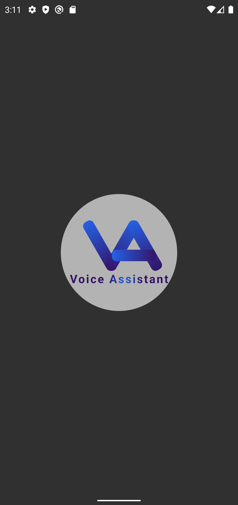
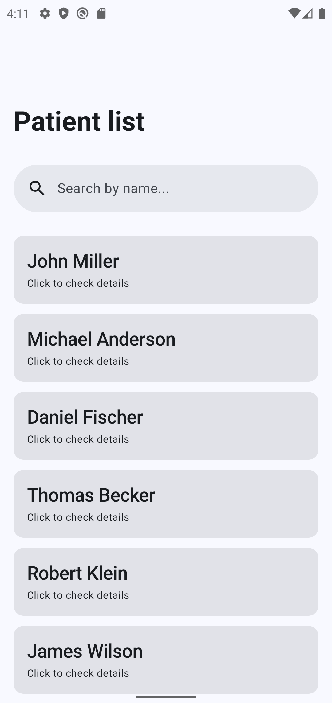 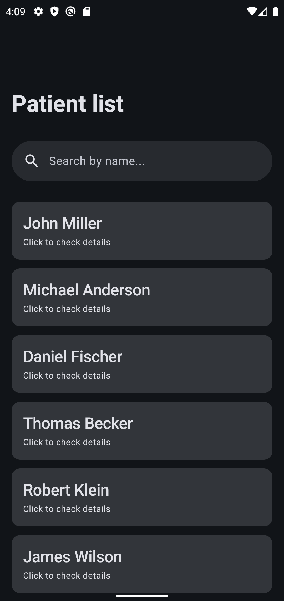

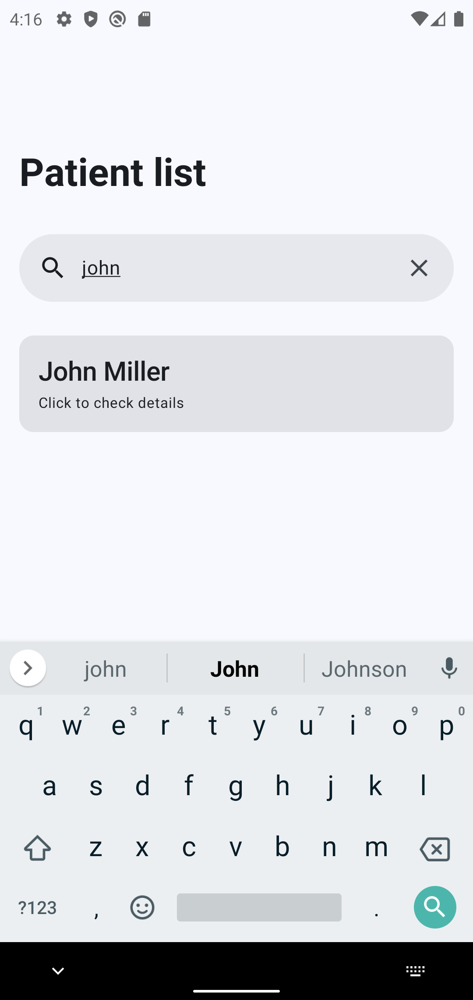 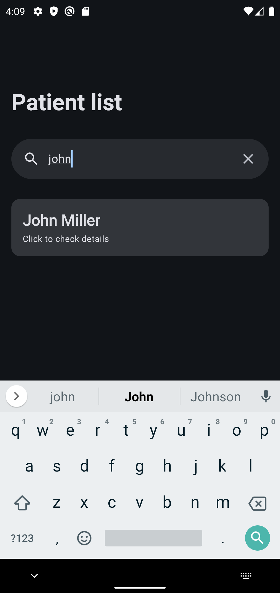
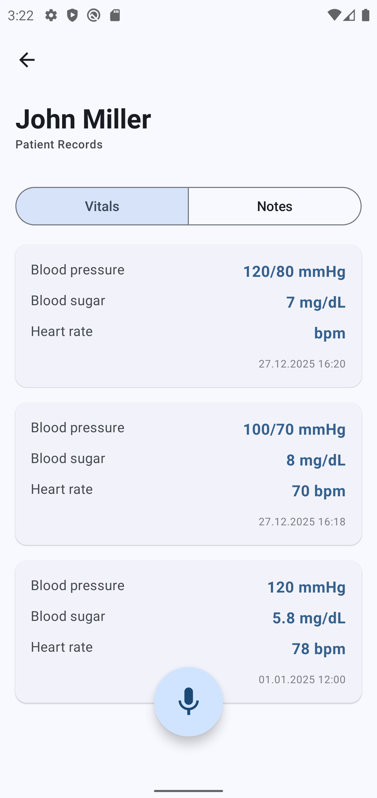 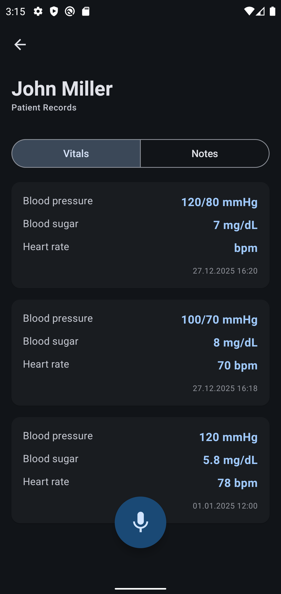

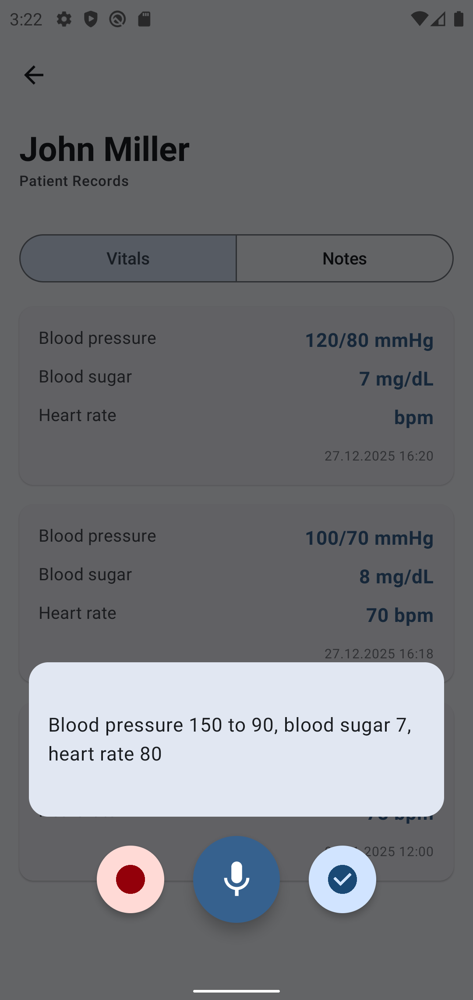 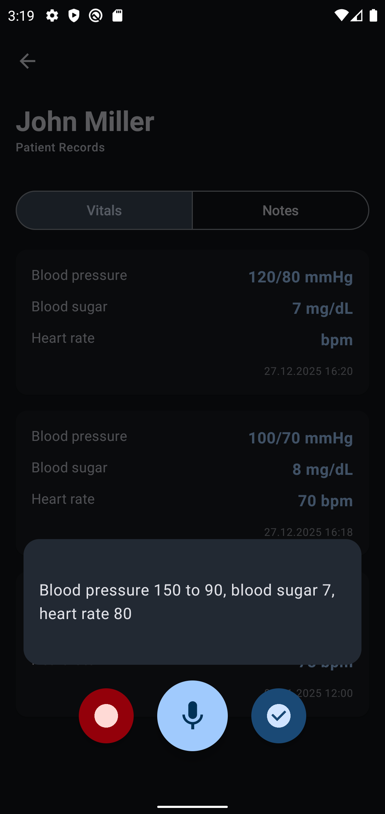
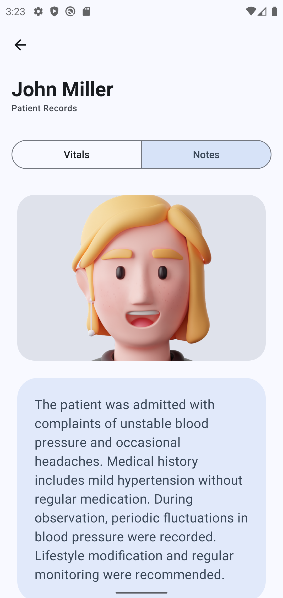 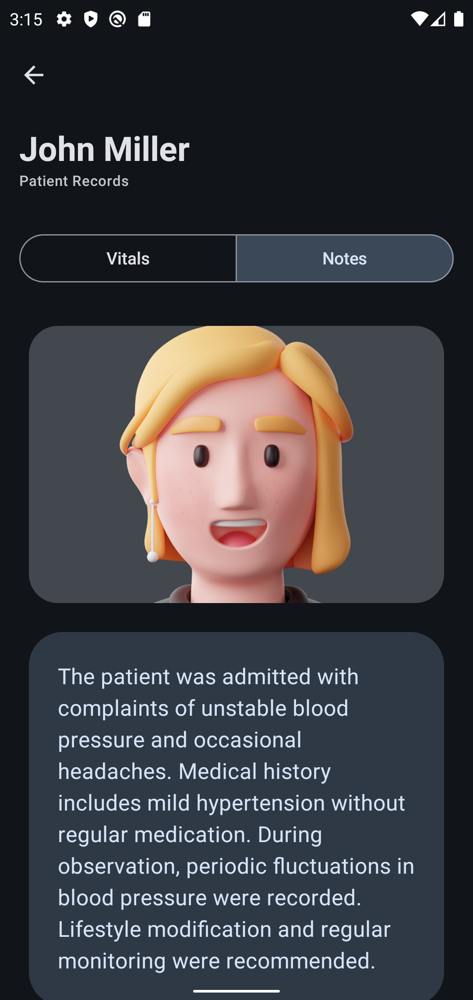

# Tech Stack
- **Kotlin Multiplatform**

- **MVVM**

- **Clean Architecture**

- **Jetpack Compose**

- **Coroutines**

- **Ktor** for client-server interaction

- **Dependency Injection** (Koin)

- **Room DB**

- **JUnit tests**

